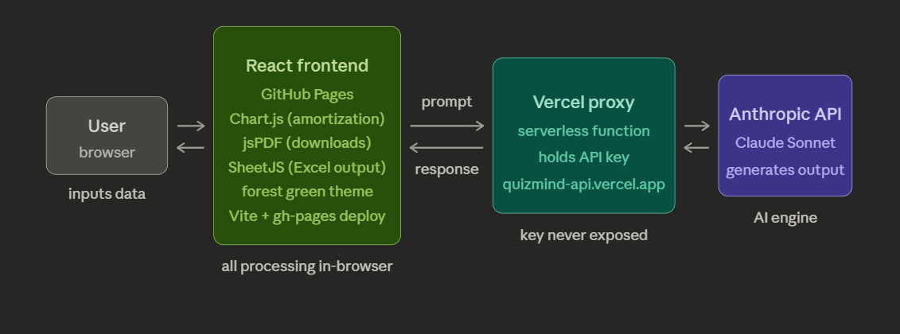

# myFinance

An AI-powered personal finance tool built with React. Helps users budget, improve credit, find the right bank, understand loan amortization, and build an investment strategy.

**Live:** [hebronabel1.github.io/myfinance](https://hebronabel1.github.io/myfinance)  
**Access code:** myFinance2026

---

## Architecture

---

## Modules

### Budgeting

### Credit

### Banking

### Financing

### Investing

---

## Tech Stack

| Layer | Technology |
|-------|-----------|
| Frontend | React + Vite |
| Hosting | GitHub Pages |
| Charts | Chart.js |
| PDF export | jsPDF |
| Excel output | SheetJS |
| AI engine | Claude Sonnet (Anthropic API) |
| Backend proxy | Vercel Serverless Functions |

---

## AI Sources

NerdWallet · Bankrate · Fidelity · CFPB · IRS.gov · MyFico · Schwab · Vanguard · Investopedia · SEC.gov · FINRA · Morningstar · JP Morgan · Motley Fool · Kiplinger